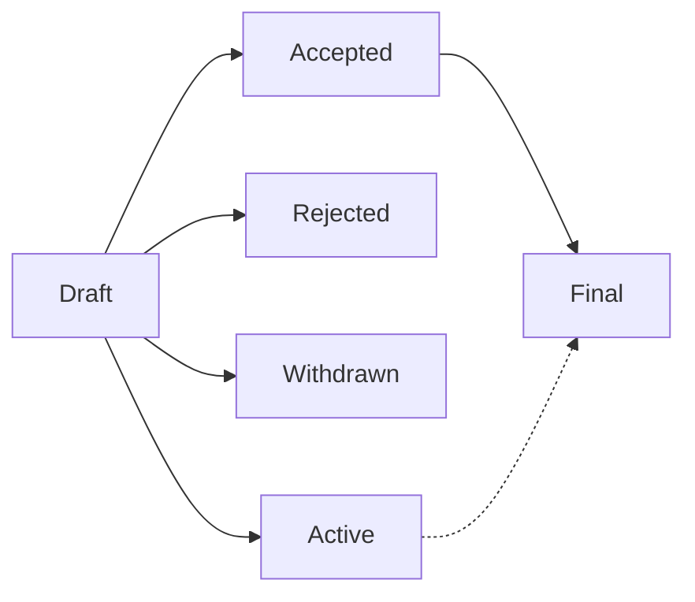

# P4PER#4 - P4PER Purpose and Guidelines

---
!!! info

    - **Author**:
        Bili Dong ([@qobilidop]),
        Fabian Ruffy ([@fruffy]),
        Steffen Smolka ([@smolkaj]),
        Andy Fingerhut ([@jafingerhut])
    - **Tracking issue**: [p4lang/p4per#4](https://github.com/p4lang/p4per/issues/4) (created 2026-04-12)
    - **Type**: Process
    - **Status**: Draft
    - **Changelog**
        - [p4lang/p4per#7](https://github.com/p4lang/p4per/pull/7) (merged 2026-05-30) - First draft.
---

[@fruffy]: https://github.com/fruffy
[@jafingerhut]: https://github.com/jafingerhut
[@qobilidop]: https://github.com/qobilidop
[@smolkaj]: https://github.com/smolkaj

## What is a P4PER?

P4PER stands for P4 Project Enhancement Request. A P4PER is a design document providing information to the P4 community, or describing a new feature for P4 or its processes or environment. The P4PER should provide a concise technical specification of the feature and a rationale for the feature. The P4PER author is responsible for building consensus within the community and documenting dissenting opinions.

For now (as of May 2026), P4PER is opt-in rather than mandatory: feel free to use it when it helps with presenting, discussing, or coordinating your proposal. We may revisit this once the community has more experience with the process. If it works well, we envision the P4PER process becoming the primary mechanism for proposing major new features, collecting community input, and documenting the design decisions shaping P4. This is similar to the role that [PEPs](https://peps.python.org/) have played in the Python community.

## P4PER types

There are three types of P4PER:

1. A **Technical** P4PER describes a new feature or implementation for P4. It may also describe any technical design broadly related to P4. Once accepted, implementations of the described feature are expected to conform to the P4PER.
2. An **Informational** P4PER describes a P4 design issue, or provides general guidelines or information to the P4 community, but does not propose a new feature. Informational P4PERs do not necessarily represent a P4 community consensus or recommendation, so users and implementers are free to ignore them or follow their advice.
3. A **Process** P4PER describes a process surrounding P4, or proposes a change to (or an event in) a process. Process P4PERs are like Technical P4PERs but apply to non-technical areas. They often require community consensus. Unlike Informational P4PERs, they are more than recommendations, and users are typically not free to ignore them.

## P4PER number

A P4PER is uniquely identified by a number N assigned during [submission](#p4per-lifecycle). To refer to a P4PER, use the format P4PER#N. For example, this P4PER is P4PER#4.

## P4PER governance

The current [P4 Technical Steering Team (TST)](https://p4.org/governance/) administers the P4PER process, including keeping this document up to date, and is its final authority. Reach out to them for anything unclear in practice.

## P4PER workflow

### P4PER roles

The following roles are involved:

- **Author**: The individual(s) who write the P4PER document.
- **Champion**: One of the authors, responsible for coordinating all work related to a P4PER and getting it done. The creator of a [P4PER tracking issue](#p4per-lifecycle) becomes that P4PER's champion automatically.
- **Editor**: Eligible individuals responsible for managing the administrative (e.g. identifying an appropriate approver) and editorial (e.g. spelling, formatting) aspects of the P4PER workflow. Editors don't pass judgment on whether a P4PER should be accepted. Editors can overlap with authors.
- **Approver**: Eligible individuals responsible for making the decision on whether a P4PER should be accepted or not, on behalf of the P4 community. Approvers cannot overlap with authors, but can overlap with editors.

The following individuals are eligible editors and approvers:

- Current [P4 TST](#p4per-governance) members.
- Current [P4 Working Groups (WG)](https://p4.org/working-groups/) chairs.
- Any other individuals appointed by P4 TST members or P4 WG chairs for a specific P4PER.

### P4PER status

- **Draft**: The P4PER has editor approval and is merged to the repo for public review, but is **not yet accepted**.
- **Accepted**: The P4PER is **accepted** with approver approval, but related work is **not fully complete**.
    - Related work is defined by the specific P4PER. For **Technical** P4PERs, it typically includes implementation of the proposed feature.
    - If there is no related work, skip Accepted and go directly to Final.
- **Final**: The P4PER is **accepted** with approver approval, and all related work is **fully complete**.
- **Rejected**: The P4PER is **rejected** after approver review.
    - Rejected P4PERs are kept in the repo as historical records.
- **Withdrawn**: The P4PER is **withdrawn** by its author(s).
    - Withdrawn P4PERs are kept in the repo as historical records.
- **Active**: The P4PER is a continuously updated living document, **accepted** with approver approval and kept **up to date**.
    - An Active P4PER can transition to Final if it's no longer expected to be a living document.
    - Only **Informational** and **Process** P4PERs can be living documents.

The diagram below illustrates typical status progressions, but is not exhaustive: other transitions might be valid (e.g., Accepted → Rejected), and a single PR may cover multiple transitions (e.g., a P4PER going directly to Final). When in doubt, just [send a PR](#p4per-lifecycle), and we'll sort things out in review.

### P4PER lifecycle

1. **Create a tracking issue for the P4PER**
    - An author opens an issue in the [P4PER GitHub repo](https://github.com/p4lang/p4per) and becomes the P4PER champion.
        - Example: <https://github.com/p4lang/p4per/issues/4>
    - The issue number becomes the [P4PER number](#p4per-number).
    - Request that an [editor](#p4per-roles) be assigned for this P4PER.
    - This issue is the coordination hub for all related work. Cross-link it with related PRs and issues.
2. **Create and update the P4PER via PRs**
    - The P4PER champion is responsible for opening PRs to create or update the P4PER, and following them through review until they are merged.
        - Example: <https://github.com/p4lang/p4per/pull/7>
        - If the PR keeps the P4PER in Draft, or moves it to Withdrawn, ask the editor to review the PR. A single editor's approval is sufficient for merging.
        - If the PR moves the P4PER to Accepted, Final, or Active, ask the editor to assign one or more [approvers](#p4per-roles) to review the PR. Approval from all assigned approvers is required for merging. If approvers reject the P4PER during review, update the PR to mark it as Rejected.
3. **Complete any related work**
    - Related work is defined by the specific P4PER (see [P4PER status](#p4per-status)). For **Technical** P4PERs, it typically includes implementation in the relevant project repos (e.g. [P4C](https://github.com/p4lang/p4c), [P4Runtime](https://github.com/p4lang/p4runtime)). The P4PER champion coordinates this work.
    - Once all related work is complete, send a PR to move the P4PER to Final.

## Prior art

The P4PER process was directly inspired by [Python Enhancement Proposals (PEPs)](https://peps.python.org/). The writing of this document drew heavily from the following meta documents that play the same role in their respective communities:

- [Python's PEP 1](https://peps.python.org/pep-0001/)
- [Ethereum's EIP-1](https://eips.ethereum.org/EIPS/eip-1)

See also other community proposal processes that we have learned from:

- [IETF RFCs](https://www.rfc-editor.org/)
- [Rust RFCs](https://github.com/rust-lang/rfcs)
- [Kubernetes KEPs](https://github.com/kubernetes/enhancements)
